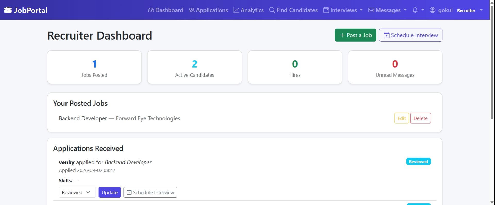

# Job Portal

A full-stack job application platform built with **Django, Django Channels (WebSockets), MySQL, Bootstrap, and JavaScript**. Recruiters post jobs and manage hiring pipelines, candidates discover and apply for roles, and admins oversee the whole platform — all in real time.

🔗 **Live:** [job-portal-dn0u.onrender.com](https://job-portal-dn0u.onrender.com)
💻 **Repo:** [github.com/venky2702001/job-portal](https://github.com/venky2702001/job-portal)

---

## 🚀 Features

**Accounts & Roles**
- Role-based accounts for Candidates, Recruiters, and Admins, each with a dedicated dashboard
- Separate login pages for candidates and recruiters, with role-mismatch protection
- Recruiter signups require admin approval before activation
- Forgot-password / password reset flow via email

**For Candidates**
- Browse and search jobs (public — no login required to view listings)
- Apply to jobs with resume upload
- Save jobs for later, with a dedicated "Saved Jobs" list
- Track applications through a 5-stage pipeline: Applied → Reviewed → Accepted / Rejected → Hired
- Manage interview invites — confirm, decline, or request a reschedule
- Real-time in-app notifications and messaging (no page refresh needed)

**For Recruiters**
- Post, edit, and delete job listings (with skill-tag matching for recommendations)
- Review applications per job, with resume downloads
- Search and filter candidates by skill, location, and application status
- Schedule interviews and track their status
- Analytics dashboard — applications by status and by job posting

**For Admins**
- Approve or reject pending recruiter accounts
- Platform-wide analytics (jobs, applications, candidates)
- Full Django admin access

**Under the hood**
- Real-time notifications & messaging via Django Channels / WebSockets
- MySQL relational schema across 6 Django apps (accounts, jobs, applications, interviews, messaging, notifications)
- Email notifications (application confirmations, status updates, password reset) sent through the Brevo transactional email API; emails print to the console in local development
- Resume uploads stored on Cloudinary in production (Render's filesystem is ephemeral), local disk in development
- Responsive Bootstrap 5 UI with Bootstrap Icons
- Deployed on Render, static files served via WhiteNoise

---

## 🛠️ Tech Stack
- **Frontend:** HTML, CSS, Bootstrap 5, JavaScript (WebSocket client for live updates)
- **Backend:** Python, Django, Django Channels (ASGI/Daphne)
- **Database:** MySQL
- **Static files:** WhiteNoise
- **Email:** Brevo (transactional email API)
- **File storage:** Cloudinary (resume uploads in production)
- **Version Control:** Git & GitHub
- **Deployment:** Render

---

## 📂 Project Structure
```
jobportal/
│── accounts/         # Auth, roles, candidate/recruiter profiles, admin approval
│── jobs/             # Job posting, listing, search
│── applications/     # Applications, saved jobs, recruiter analytics
│── interviews/       # Interview scheduling & status tracking
│── messaging/        # In-app messaging between users
│── notifications/    # Real-time notifications (Django Channels)
│── templates/        # Shared templates (base layout, email templates, 403 page)
│── static/           # CSS, JS, images
│── screenshots/      # UI screenshots used in this README
│── jobportal/        # Project settings, URLs, ASGI/WSGI, Channels routing
│── build.sh          # Build script used for deployment on Render
│── requirements.txt  # Python dependencies
│── manage.py
```

---

## ⚙️ Setup Instructions

1. Clone the repository:
   ```bash
   git clone https://github.com/venky2702001/job-portal.git
   cd job-portal
   ```

2. Create a virtual environment and install dependencies:
   ```bash
   python -m venv venv
   source venv/bin/activate   # On Windows: venv\Scripts\activate
   pip install -r requirements.txt
   ```

3. Create a `.env` file in the project root with:
   ```
   DJANGO_SECRET_KEY=your-secret-key
   DJANGO_DEBUG=True
   DJANGO_ALLOWED_HOSTS=127.0.0.1,localhost

   DB_NAME=your-db-name
   DB_USER=your-db-user
   DB_PASS=your-db-password
   DB_HOST=localhost
   DB_PORT=3306

   DEFAULT_FROM_EMAIL=your-from-email
   ADMIN_EMAIL=your-admin-email

   # Production only (leave unset for local development)
   DB_SSL_REQUIRED=True
   BREVO_API_KEY=your-brevo-api-key
   CLOUDINARY_CLOUD_NAME=your-cloud-name
   CLOUDINARY_API_KEY=your-cloudinary-api-key
   CLOUDINARY_API_SECRET=your-cloudinary-api-secret
   ```
   `.env` is git-ignored — never commit real credentials.

   With `DJANGO_DEBUG=True`, emails are printed to the terminal instead of being sent. With `DJANGO_DEBUG=False`, they are sent through the Brevo API, and resumes go to Cloudinary if `CLOUDINARY_CLOUD_NAME` is set.

4. Run migrations:
   ```bash
   python manage.py migrate
   ```

5. Create an admin account:
   ```bash
   python manage.py createsuperuser
   ```

6. Start the server:
   ```bash
   python manage.py runserver
   ```

7. Open [http://127.0.0.1:8000/](http://127.0.0.1:8000/) in your browser.

---

## 📸 Screenshots

| Candidate Dashboard | Notification Dropdown |
| --- | --- |
|  |  |

| Notifications List | Recruiter Dashboard |
| --- | --- |
|  |  |

---

## 📊 Future Enhancements
- Expand automated test coverage and add CI on GitHub Actions
- Pagination and richer filtering on the recruiter applications view
- Redis channel layer for WebSockets (currently in-memory, which works for a single instance)
- Convert to Django REST Framework + a JS frontend for a fully decoupled API

---

## 👨‍💻 Author
**Venkatesh K**

- LinkedIn: [linkedin.com/in/venkateshk2702001](https://linkedin.com/in/venkateshk2702001)
- GitHub: [github.com/venky2702001](https://github.com/venky2702001)
- LeetCode: [leetcode.com/u/venkatesh_2702](https://leetcode.com/u/venkatesh_2702)