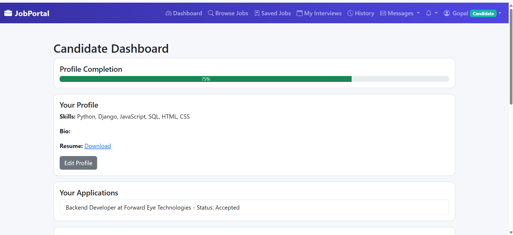
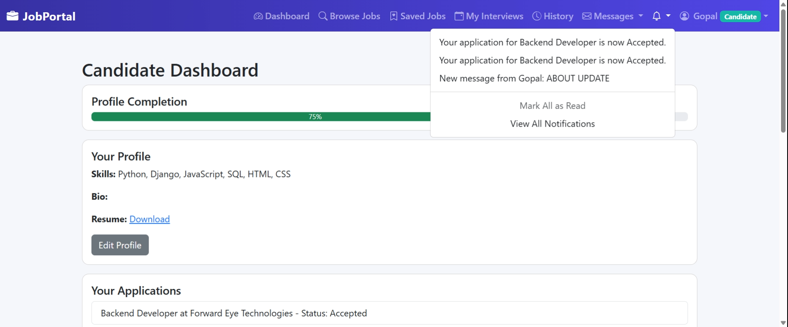
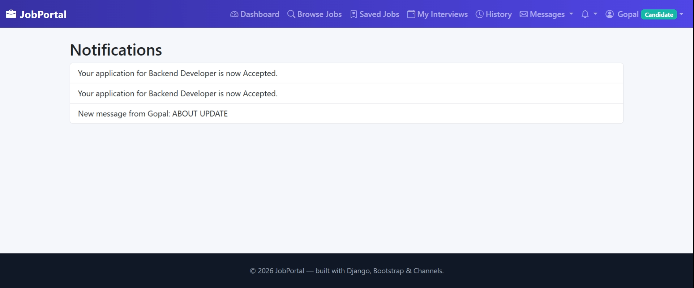

# JobPortal

A full-stack job application platform built with **Django, Django Channels, MySQL and Bootstrap**. Recruiters post jobs and manage applicants, candidates search and apply, and admins oversee users and jobs, with real-time notifications and messaging between them.

**Live demo:** https://job-portal-dn0u.onrender.com

> The demo runs on a free Render instance, so the first load can take up to a minute to wake up.

---

## Features

**Role-based access (Candidate, Recruiter, Admin)**
- Separate signup/login flows and dashboards, protected by permission checks

**For candidates**
- Browse and search jobs, save jobs for later, and apply with a resume upload
- Skill-based job recommendations
- Dashboard with profile completion, applications, saved jobs and upcoming interviews
- Application history with the current status of each application
- Confirm, decline or reschedule interview invitations

**For recruiters**
- Post and manage jobs
- Review applications and move them through the pipeline: Applied → Reviewed → Accepted / Rejected / Hired
- Search candidates by skill and location
- Analytics dashboard (applications by status and by job)
- Schedule interviews

**Real-time notifications and messaging**
- Live notification bell with unread badge, powered by Django Channels (WebSockets)
- Mark a notification, or all notifications, as read; changes sync across open tabs
- In-app messaging (inbox, sent, compose)
- Email notifications for new applications and status changes

---

## Tech Stack

| Layer | Technology |
| --- | --- |
| Backend | Python, Django 5.2 |
| Real-time | Django Channels (WebSockets) |
| Database | MySQL |
| Frontend | HTML, CSS, Bootstrap 5, JavaScript |
| Deployment | Render |
| Version control | Git, GitHub |

---

## Project Structure

```
job-portal/
├── accounts/        # Authentication, roles, candidate/recruiter profiles
├── jobs/            # Job posting, search and listing
├── applications/    # Applications, status tracking, saved jobs, dashboards
├── interviews/      # Interview scheduling and responses
├── messaging/       # In-app messages
├── notifications/   # Notification model, views and live updates
├── templates/       # Shared templates (base layout, etc.)
├── jobportal/       # Project settings, URLs, ASGI config
├── build.sh         # Build script used for deployment
├── requirements.txt
└── manage.py
```

---

## Setup

1. Clone the repository

   ```bash
   git clone https://github.com/venky2702001/job-portal.git
   cd job-portal
   ```

2. Create a virtual environment and install dependencies

   ```bash
   python -m venv venv
   source venv/bin/activate      # Windows: venv\Scripts\activate
   pip install -r requirements.txt
   ```

3. Configure the MySQL database and email settings in `jobportal/settings.py`. Keep credentials out of version control.

4. Apply migrations

   ```bash
   python manage.py migrate
   ```

5. (Optional) Create an admin user

   ```bash
   python manage.py createsuperuser
   ```

6. Start the development server

   ```bash
   python manage.py runserver
   ```

7. Open http://127.0.0.1:8000/ in your browser.

---

## Screenshots

| Candidate dashboard | Notification dropdown |
| --- | --- |
|  |  |

| Notifications list | Recruiter view |
| --- | --- |
|  |  |

---

## Future Enhancements

- Advanced job search filters (salary range, experience level)
- Automated tests for views and WebSocket consumers
- Redis channel layer for multi-instance deployments

---

## Author

**Venkatesh K**

- LinkedIn: [linkedin.com/in/venkateshk2702001](https://linkedin.com/in/venkateshk2702001)
- GitHub: [github.com/venky2702001](https://github.com/venky2702001)
- LeetCode: [leetcode.com/u/venkatesh_2702](https://leetcode.com/u/venkatesh_2702)